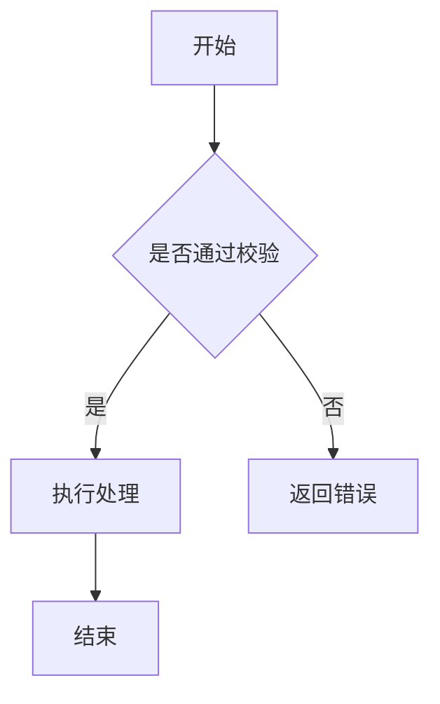

# docsify

- 使用教程
  - [Docsify-zh](https://docsify.js.org/#/zh-cn/quickstart)
  - [Docsify-en](https://docsify.js.org/#/)
  - [Docsify-使用指南](https://ysgstudyhards.github.io/Docsify-Guide/#/ProjectDocs/Docsify使用指南)

- 生成侧边栏程序指令

  ```shell
  cd /Users/zhangshuailong/Desktop/notes/notes/docs
  python3 sidebarn.py .
  ```


### dashbord

要创建仪表板，只需将以下代码添加到您的 markdown 文件中

```markdown
<!-- tabs:start -->

<!-- dashboard: metadata/posts numTabContent=5 -->

<!-- tabs:end -->
```

### tag-list

创建侧边栏标签列表，只需将以下代码添加到侧边栏文件(例如：`_sidebar.md`)

```markdown
<!-- tag-list -->
```

### Flexible Alerts

[GitHub地址](https://github.com/fzankl/docsify-plugin-flexible-alerts)

- Note

  ```markdown
  > [!NOTE]
  > An alert of type 'note' using global style 'callout'.
  ```

- Tip

  ```markdown
  > [!TIP]
  > An alert of type 'tip' using global style 'callout'.
  ```

- Warning

  ```markdown
  > [!WARNING]
  > An alert of type 'warning' using global style 'callout'.
  ```

- Attention

  ```markdown
  > [!ATTENTION]
  > An alert of type 'attention' using global style 'callout'.
  ```

### 音频播放

在 markdown 文件中使用 `audio` 代码块即可渲染音频播放器。第一行填写音频地址，后续可选配置使用 `key=value`。

````markdown
```audio
./media/demo.mp3
title=示例音频
```
````

也可以直接访问音频文件路由，例如：

```markdown
http://localhost:3000/#/media/demo.mp3
```

支持的音频格式：`mp3`、`wav`、`ogg`、`m4a`、`aac`、`flac`、`opus`。

### 视频播放

在 markdown 文件中使用 `video` 代码块即可渲染视频播放器。第一行填写视频地址，可使用 `title` 设置标题，使用 `poster` 设置封面图。

````markdown
```video
./media/demo.mp4
title=示例视频
poster=./media/demo-cover.jpg
```
````

也可以直接访问视频文件路由，例如：

```markdown
http://localhost:3000/#/media/demo.mp4
```

支持的视频格式：`mp4`、`webm`、`ogv`、`mov`、`m4v`。

### Mermaid 流程图

在 markdown 文件中使用 `mermaid` 代码块即可渲染流程图。

````markdown

````

常用方向：

```markdown
flowchart TD  从上到下
flowchart LR  从左到右
```
